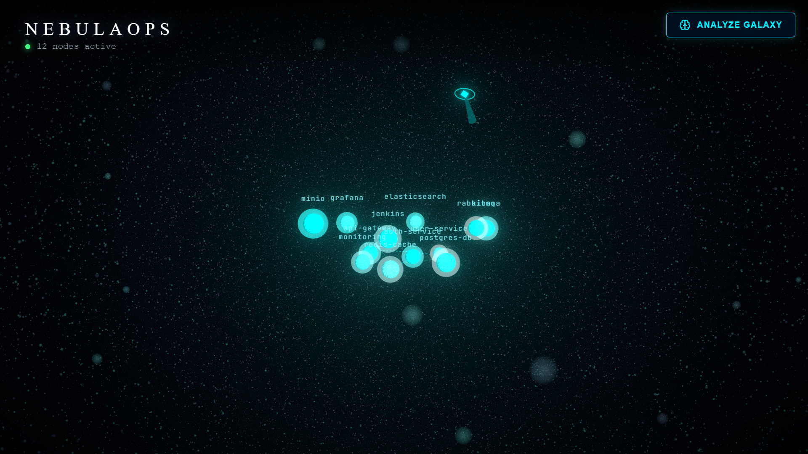
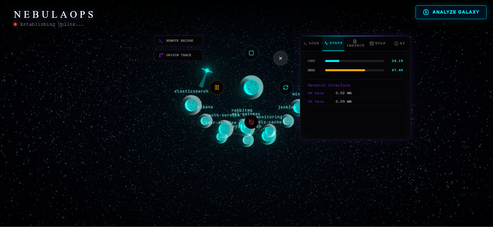
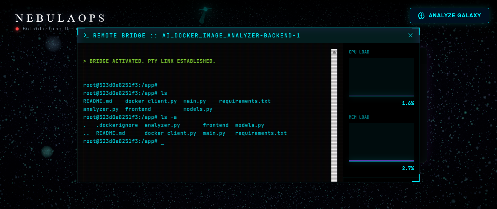
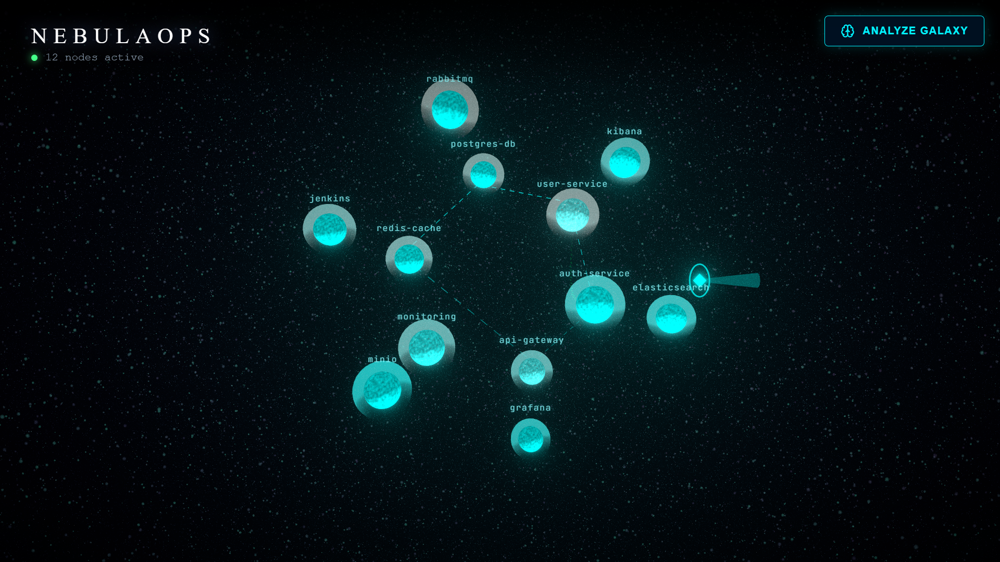
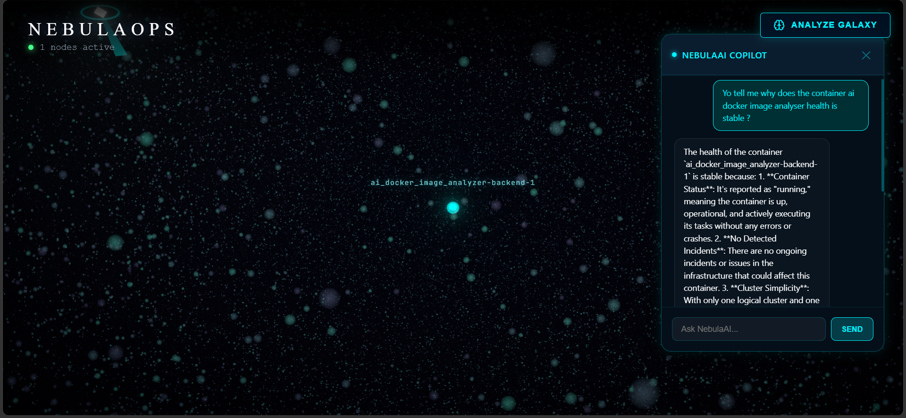
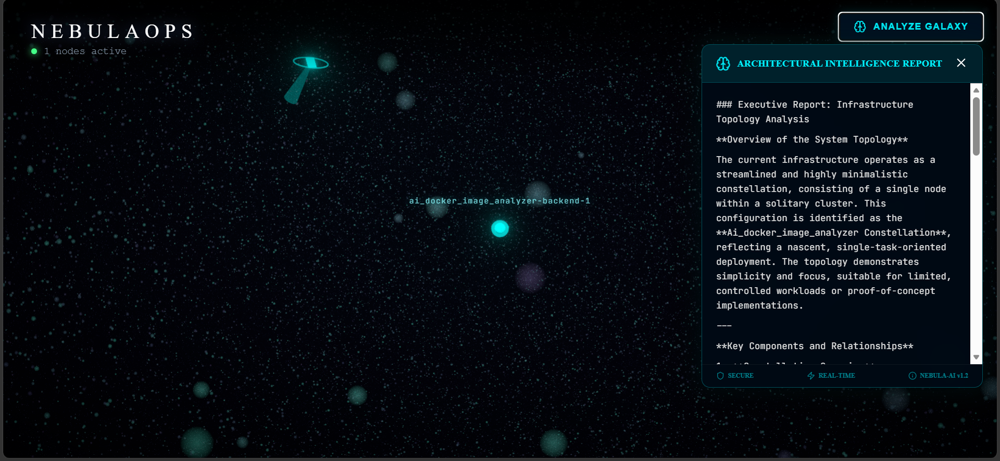

# 🌌 NebulaOps

> **NebulaOps** is an real-time 3D infrastructure explorer that transforms fractionalized container dashboards into a navigable, interactive galaxy.

 *(Placeholder for Galaxy View)*

Traditional observability tools overwhelm engineers with flat metrics and fragmented logs. NebulaOps solves this by projecting your entire Docker infrastructure into a spatial environment—turning containers into stars, networks into constellations, and anomalies into black holes. Get a visual mental model of your cluster, instantly understand service topology, and interactively debug infrastructure issues directly from a high-fidelity 3D HUD.

---

## ✨ Key Features

### 🔭 3D Galaxy Visualization
- **Live Infrastructure Mapping:** Watch your system orbit in real time. Discovery is automatic via the Docker Engine API.
- **Dynamic Visual Language:**
  | Infrastructure Element | 3D Visualization | Dynamic Attribute |
  | :--- | :--- | :--- |
  | **Container** | 🌟 Star | Size = Memory, Brightness = CPU |
  | **Service / Network** | 🌌 Constellation | Glowing connection lines grouping related services |
  | **Incident / Anomaly** | 🕳️ Black Hole | Gravitational distortion, red glow, particle attraction |
  | **Event (Crash/Kill)** | 💥 Explosion | Instant visual feedback on container failure |

### 🛠️ Interactive Command & Control
- **Tactical HUD Controls:** Click on any star to invoke a tactical menu. Directly Start, Stop, Kill, Restart, Pause, and Unpause containers without leaving the 3D environment.
- **Sensor Suite:** Detailed per-container inspection panel streaming live CPU/Memory telemetry, active network activity, Docker inspect metadata, volumes, and trailing logs.

 *(Placeholder for Interactive Command & Control)*

- **Remote Bridge Shell:** Open a fully styled, embedded `xterm.js` terminal connecting directly (`bash`/`sh`) into the container via WebSocket for immediate real-time debugging.

 *(Placeholder for Remote Bridge Shell)*

### 🧠 AI-Powered "Neural" Intelligence
- **AI Constellation Mapper:** Automatically groups containers into logical service clusters (constellations) based on shared networks and communication patterns.

 *(AI Constellation Mapper)*

- **Incident Detection & Analysis:** Actively monitors for CPU/Memory spikes, presenting anomalies visually as black holes and analyzing them for root cause hints.
- **AI DevOps Copilot:** A floating spatial AI drone object you can interact with. Ask questions like *"Why is my API latency spiking?"* and it will scan live metrics, logs, and relationships to provide contextual answers.

 *(Placeholder for AI Copilot)*

- **Log Summarization:** Instantly parse thousands of trailing log lines into a plain-English situation report via AI.
- **AI Galaxy Explainer:** Click "ANALYZE GALAXY" to generate a comprehensive LLM-powered overview of your entire infrastructure topology, including service relationships, health assessments, and architectural insights.

 *(Placeholder for AI Galaxy Explainer)*

---

## 🎮 Demo Mode (Zero-Config)

NebulaOps includes a **Transparent Demo Mode** for users who want to explore the interface without a running Docker daemon.

- **Automatic Fallback:** If the backend cannot connect to a `/var/run/docker.sock`, it automatically initializes a high-fidelity mock infrastructure (simulating varied loads and services).
- **Zero Configuration:** Simply start the app with no Docker daemon needed — the demo galaxy spawns automatically.

---

## 🚀 Getting Started

NebulaOps has a **built-in demo mode** — if no Docker daemon is detected, the backend automatically spawns a simulated galaxy with mock containers. You can explore the full UI without any infrastructure.

### Prerequisites
- **Node.js** (v18+) and **Python** (3.9+) — for manual dev.
- **Docker** (Docker Desktop on Windows with WSL2 backend) — for Docker Compose or Docker Hub paths.
- **AI Features:** A **GitHub Token** (free via GitHub Models) or **OpenAI API Key** (optional).

---

### 🛠️ Option A: Manual Development

Run backend and frontend separately for hot-reload. **No Docker daemon required** — demo mode kicks in automatically.

1. **Clone & Enter:**
   ```bash
   git clone https://github.com/chadm2c/nebulaops.git
   cd nebulaops
   ```

2. **AI Setup (Optional):**
   Create `backend/.env`:
   ```env
   GITHUB_TOKEN=ghp_your_github_token
   # or
   OPENAI_API_KEY=sk_your_openai_key
   ```

3. **Start the Backend** (terminal 1):
   ```bash
   cd backend
   python -m venv venv
   # Windows: venv\Scripts\activate
   source venv/bin/activate
   pip install -r requirements.txt
   uvicorn app.main:app --host 0.0.0.0 --port 8000 --reload
   ```

4. **Start the Frontend** (terminal 2):
   ```bash
   cd frontend
   npm install
   npm run dev
   ```

5. **Explore:**
   - **HUD Interface:** [http://localhost:3000](http://localhost:3000)
   - **Backend API:** [http://localhost:8000/docs](http://localhost:8000/docs)

   The Vite dev server proxies `/api` and WebSocket requests to the backend automatically.

---

### 🏗️ Option B: Build Locally with Docker Compose

Clone, build, and run from source. **Works with or without a Docker daemon** — demo mode auto-falls back.

1. **Clone & Enter:**
   ```bash
   git clone https://github.com/chadm2c/nebulaops.git
   cd nebulaops
   ```

2. **AI Setup (Optional):**
   Create `.env` in the project root:
   ```env
   GITHUB_TOKEN=ghp_your_github_token
   # or
   OPENAI_API_KEY=sk_your_openai_key
   ```

3. **Launch:**
   ```bash
   docker compose up
   ```

4. **Explore:**
   - **HUD Interface:** [http://localhost:80](http://localhost:80)
   - **Backend API:** [http://localhost:8000/docs](http://localhost:8000/docs)

---

### 🐳 Option C: Run from Docker Hub (Simplest)

No clone or build needed. Just pull and run:

```bash
# Pull the images
docker pull chadmany20/nebulaops-backend:latest
docker pull chadmany20/nebulaops-frontend:latest

# Create a network
docker network create nebulaops

# AI Setup (Optional): create .env with your token
echo "GITHUB_TOKEN=ghp_your_github_token" > .env
# or: echo "OPENAI_API_KEY=sk_your_openai_key" >> .env

# Pick ONE backend command below — running both will conflict on port 8000

# Without AI features (skip if you created .env):
# docker run -d --name nebulaops-backend \
#   --network nebulaops \
#   -p 127.0.0.1:8000:8000 \
#   -v /var/run/docker.sock:/var/run/docker.sock \
#   chadmany20/nebulaops-backend:latest

# With AI features (requires .env with tokens):
docker run -d --name nebulaops-backend \
  --network nebulaops \
  -p 127.0.0.1:8000:8000 \
  -v /var/run/docker.sock:/var/run/docker.sock \
  --env-file .env \
  chadmany20/nebulaops-backend:latest

# Start the frontend
docker run -d --name nebulaops-frontend \
   --network nebulaops \
   -p 127.0.0.1:80:80 \
   chadmany20/nebulaops-frontend:latest

# Open http://localhost:80
```

No Docker daemon? Demo mode fires up automatically with simulated containers.

---

## 🏗️ System Architecture

NebulaOps is built on a high-concurrency "Neural" stack designed to process telemetry efficiently:
- **Frontend:** React + Three.js (`@react-three/fiber`) + Framer Motion. Renders at a smooth 60 FPS while managing complex 3D scenes.
- **Backend:** FastAPI + Python `docker` SDK + WebSockets. Engineered for ~1ms telemetry loops processing container states and system stats.
- **Intelligence:** Modular AI agents via LLM integrations.

 *(Placeholder for Architecture Diagram)*

---

## 🗺️ Roadmap & Future Features

While NebulaOps already provides a robust visual DevOps experience, the following features are actively planned for future milestones:
- **⏱️ AI Time Warp (Infrastructure Replay):** A spatial timeline slider that replays past incidents (container drops, resource spikes) like a DVR for your infrastructure.
- **☸️ Kubernetes Integration:** Expanding orchestration support to map Namespaces, Deployments, Pods, and Services natively in 3D.
- **🥽 VR / WebXR Mode:** Native immersive headset exploration of your clusters for the ultimate spatial computing DevOps experience.

---

## 🛠️ Troubleshooting

- **"Docker not available" Error (AI features / Metrics won't load):** 
  - Ensure Docker Desktop is running.
  - Check your volume mounts in `docker-compose.yml`. You must mount the system boundary `/var/run/docker.sock` to the backend.
  - If you encounter permission errors on Linux, ensure your user is in the `docker` group, or provide specific ACLs to the mounted socket.
- **AI Link Offline / "Summarization Failed":** Ensure your `.env` file is set up correctly — place it in the **project root** if using Docker Compose, or in `backend/` for manual dev. Make sure the API key is active/funded.

## 🛡️ Security

NebulaOps requires **highly privileged access** (`docker.sock`) for real-time monitoring and terminal access. 
⚠️ **NEVER expose the NebulaOps ports (80/8000) to the public internet** without a rigorous reverse proxy, VPN, and robust authentication layer. Read-only capability scaling is under development.

## 📜 License
MIT License - See [LICENSE](LICENSE) for details.
